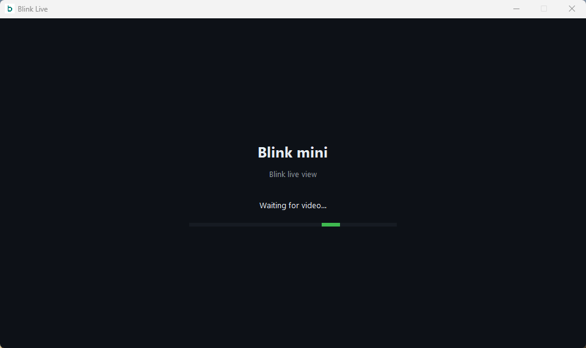
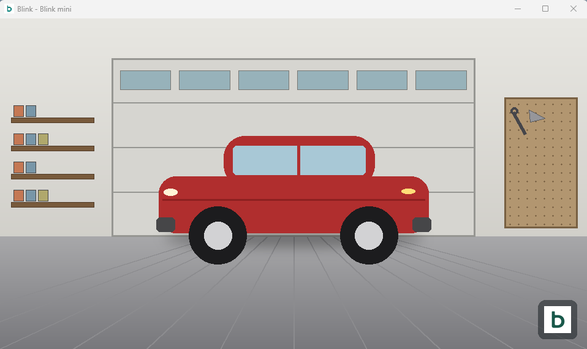

  

<h1 align="center">Blink Live View</h1>

<em>A tiny Windows desktop app that opens your Blink camera's live feed in its own window — no browser, no app switching.</em>

  
  
  

---

## What it does

Double-click one shortcut and get a native window that signs in to Blink, requests a live stream from one camera on your account, and plays it — embedded directly in the window, not in a separate `ffplay` popup. Close the window and the stream shuts down cleanly.

It's built for one thing: a fast, always-the-same-camera live view, without opening the Blink app or a browser tab every time.

## In action

<table>
<tr>
<td align="center"><b>Signing in / connecting</b></td>
<td align="center"><b>Live view playing</b></td>
</tr>
<tr>
<td></td>
<td></td>
</tr>
</table>

*(The live-view screenshot shows a placeholder scene, not an actual camera feed.)*

## How it works

- [`blinkpy`](https://github.com/fronzbot/blinkpy) handles authentication and the Blink API/streaming protocol — this project is a thin desktop shell around it. All credit for the hard part (talking to Blink's cloud) goes to that project.
- `live.py` starts the stream, hands the URL to `ffplay`, and uses the Win32 API to reparent `ffplay`'s window inside a `tkinter` window so it looks like one native app.
- Login and your chosen camera are saved locally (`credentials.json`, `config.json`) so you only set up once.

## Prerequisites

- **Windows** (the window-embedding trick is Win32-specific)
- **Python 3.9+** — get it from [python.org](https://www.python.org/downloads/) (check "Add to PATH" during install)
- **FFmpeg** — specifically `ffplay.exe` must be on your `PATH`. Get it from [ffmpeg.org](https://ffmpeg.org/download.html) or `winget install ffmpeg`
- A Blink account with at least one camera

## Getting started

1. **Download or clone** this repo.
2. Run **`Setup.bat`** — creates a local virtual environment, installs dependencies, then walks you through Blink login (email/password, 2FA code if prompted) and lets you pick which camera this shortcut opens.
3. Run **`Create Desktop Shortcut.bat`** — adds a "Blink Live View" shortcut to your Desktop, icon included.
4. From now on, just use **`Run.bat`** (or the Desktop shortcut) to open the live view.

Only run `Setup.bat` again if you want to switch cameras or you deleted `credentials.json`/`config.json`.

## Files

| File | Purpose |
|---|---|
| `Setup.bat` | One-time: creates the venv, installs deps, signs in, picks a camera |
| `Run.bat` | Opens the live view window |
| `Create Desktop Shortcut.bat` | Adds a Desktop shortcut for `Run.bat` |
| `first_run.py` | Login + camera picker script, run by `Setup.bat` |
| `live.py` | The live view window itself, run by `Run.bat` |
| `config.example.json` | Template showing the shape of the (gitignored) `config.json` |

`credentials.json`, `config.json`, `blink-live.log`, and `.venv/` are all created locally by `Setup.bat`/`Run.bat` and are gitignored — they're specific to your machine and account, and `credentials.json` holds your live session tokens, so it should never be committed or shared.

## Troubleshooting

Something not working? Check `blink-live.log` in this folder first — it logs sign-in, streaming, and player errors.

- **"ffplay not found on PATH"** — install FFmpeg and make sure `ffplay.exe`'s folder is in your PATH, then reopen.
- **"Sign-in failed"** — delete `credentials.json` and run `Setup.bat` again.
- **"Camera not on this account"** — re-run `Setup.bat` to pick a different camera.

## Acknowledgments

This project wouldn't exist without [**blinkpy**](https://github.com/fronzbot/blinkpy) by [fronzbot](https://github.com/fronzbot) and contributors, which does all the Blink API and streaming heavy lifting. `live.py` and `first_run.py` here are just a Windows desktop UI wrapped around it.

## Version

**v1.0** — first packaged release: setup/run/shortcut scripts, embedded live view window, saved login + camera selection.
